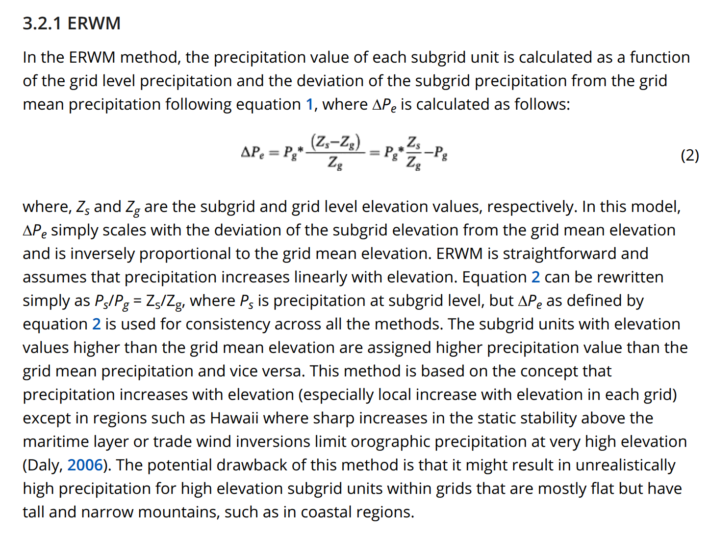
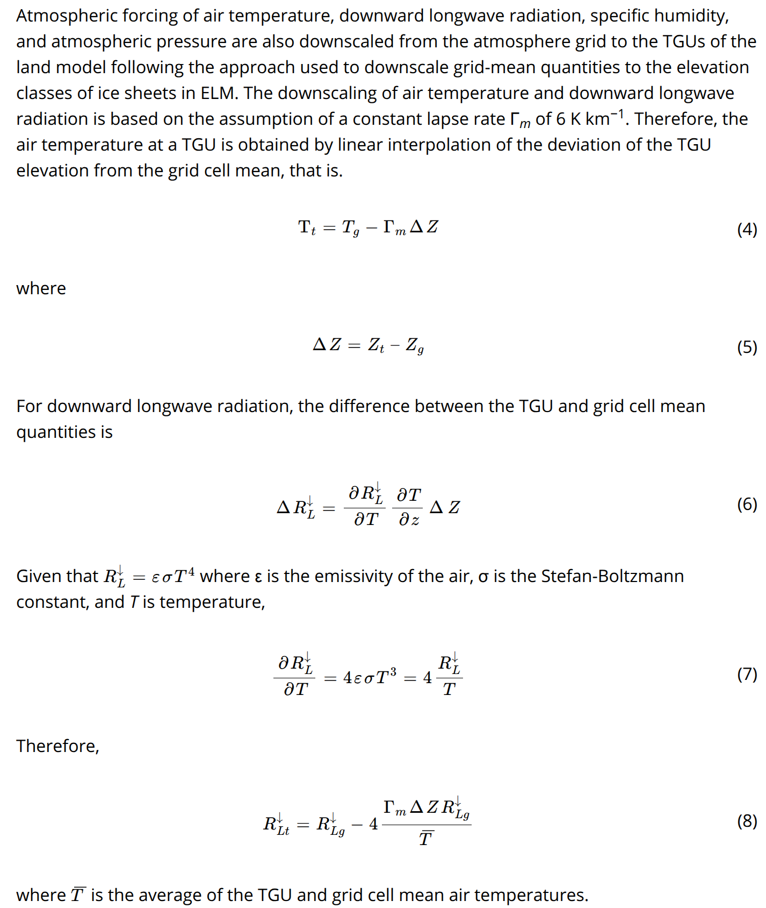

Hillslope hydrology and BGC impacts breakout group
==================================================

Objectives of the workshop breakout
-----------------------------------
Objectives of this workshop breakout is learn how to set up and run ELM
simulations to explore a set of four ELM configurations:

+---------+---------------------------+------------------+---------------------+------------------------------+
| ID      | Features                  | Spatial Extent   | Spatial Resolutions | Configuration name (CODE)    |
+=========+===========================+==================+=====================+==============================+
| IM0_DS0 | Topounits                 | Panarctic        | 0.5 deg             | Baseline (IM0_DS0)           |
+---------+---------------------------+------------------+---------------------+------------------------------+
| IM0_DS1 | Topounits                 | Panarctic        | 0.5 deg             |                              |
|         | + meteorology downscaling |                  |                     | Met. Downscaling (IM0_DS1)   |
+---------+---------------------------+------------------+---------------------+------------------------------+
| IM1_DS0 | Topounits                 | Panarctic        | 0.5 deg             |                              |
|         | + IM2 hillslope hydrology |                  |                     | Hillslope Hydrology (IM1_DS0)|
+---------+---------------------------+------------------+---------------------+------------------------------+
| IM1_DS1 | Topounits                 | Panarctic        | 0.5 deg             |                              |
|         | + meteorology downscaling |                  |                     | Met. Downscaling +           |
|         | + IM2 hillslope hydrology |                  |                     | Hillslope Hydrology (IM1_DS1)|
+---------+---------------------------+------------------+---------------------+------------------------------+

Background on ELM features we will explore
------------------------------------------

Topounits
~~~~~~~~~
Topography-based subgrid scheme (or **Topounits**) and methods for
downscaling of atmospheric forcings were introduced in ELM by Tesfa et.
al. 2024 to better resolve terrestrial processes in regions of
heterogeneous terrain. 

::

    Tesfa, T. K., Leung, L. R., Thornton, P. E., Brunke, M. A., & Duan, Z. (2024). Impacts of Topography‐Based Subgrid Scheme and Downscaling of Atmospheric Forcing on Modeling Land Surface Processes in the Conterminous US. Journal of Advances in Modeling Earth Systems, 16(8). https://doi.org/10.1029/2023ms004064

Tesfa et. al. 2024 derived **topounits** from high resolution elevation data (90 m) for the half
degree grids. **Topounits**‐based surface properties (including PFTs,
soil texture etc.) input parameters were
generated by mapping grid‐level values onto the TGUs of each grid.

The algorithm extracts elevation values based on the boundary of the modeling unit (grid) and discretizes the
modeling unit into 12 initial subgrid units using the 12 percentile elevation values calculated to represent the
elevation values at each consecutive percentile (10th, 20th, 30th, 40th, 50th, 60th, 70th, 80th, 85th, 90th, 95th and
100th). Then, the 12 values of elevation range are determined using the minimum elevation value within each grid
and the corresponding percentile elevation values as class breaks.
Furthermore, the 100‐m elevation threshold value is used to
calculate new values of elevation class break using a recursive
algorithm developed by Tesfa et. al. 2024. The recursive
algorithm merges any elevation class with elevation range less than the
threshold value to its neighboring class recursively until all the classes with elevation range smaller than the threshold value are removed.
This allows the topography‐based subgrid scheme to capture the impacts of topographic heterogeneity while
minimizing computational demand of the model by varying the number of
**topounits** per grid depending on the topographic heterogeneity within each modeling unit.

.. figure:: ../_static/hillslope_bgc/Tesfa_2024_topounits_workflow.png
   :alt: Topounits workflow

.. list-table::
   :widths: 50 50
   :class: borderless

   * - .. figure:: ../_static/hillslope_bgc/toolik_dem_latlon.png
         :width: 100%

         Digital Elevation Model (DEM) near Toolik Field Station

     - .. figure:: ../_static/hillslope_bgc/toolik_dem_grouped.png
         :width: 100%

         Topounits (recursive merging) for Toolik Field Station identify 6 topounits

Plot below show the 12 percentile based elevation bins and the recursive
merge strategy to create the topounits.

.. figure:: ../_static/hillslope_bgc/toolik_elevation_summary.png
   :alt: Topounits workflow

Plot below shows the number of topounits across a 0.5 degree Pan-Arctic
ELM grid.

.. figure:: ../_static/hillslope_bgc/panarctic_topounits.png
   :alt: Panarctic Topounits

Atmospheric Downscaling Scheme
~~~~~~~~~~~~~~~~~~~~~~~~~~~~~~
Elevation Range with Maximum elevation Method (ERMM) devveloped by Tesfa
et. al. 2020 is used to downscale atmospheric forcings from gridcell to
topounits. The ERMM method uses only the topographic characteristics of the grid and the TGUs to disaggregate grid-level precipitation to the TGUs of the grid.

  ::

    Tesfa, T. K., Leung, L. R., & Ghan, S. J. (2020). Exploring topography-based methods for downscaling subgrid precipitation for use in Earth System Models. Journal of Geophysical Research: Atmospheres, 125, e2019JD031456. https://doi.org/10.1029/2019JD031456

IM2 Hillslope Hydrology
~~~~~~~~~~~~~~~~~~~~~~~
.. list-table::
   :widths: 50 50
   :class: borderless

   * - .. figure:: ../_static/hillslope_bgc/IM2_scheme_1.png
         :width: 100%

         Connections among multiple topounits (labeled a through g) on a single gridcell. Each topounit is connected to at most one other downhill topounit (the next lowest in elevation), while the lowest topounit does not have a downhill connection. 

     - .. figure:: ../_static/hillslope_bgc/IM2_scheme_2.png
         :width: 100%

         Arrangement of topounits, columns, state variables, and water fluxes 

.. list-table::
   :widths: 50 50
   :class: borderless

   * - .. figure:: ../_static/hillslope_bgc/IM2_scheme_3.png
         :width: 100%

         A summary of water fluxes for a single column. 

     - .. figure:: ../_static/hillslope_bgc/IM2_scheme_4.png
         :width: 100%

         Summary representation of hillslope hydrology fluxes at the topounit level. The water state variable for one topounit (gray shaded box) receives water from a column on an uphill topounit (column a). The operator symbol represents combined user parameter for the fraction of column-level flux to transport downhill and the scaling factor accounting for potential difference in area between the upstream column and the downstream topounit. Water leaving the topounit water state is moved to columns on the topounit .

Running ELM
-----------
We will use Council C71 site (at Seward Peninsula of Alaska) for all
simulations in this exercise. 
To run ELM in offline mode (without coupling to other E3SM
components), we would need input datafiles as summarized below:

https://github.com/ORNL-Ecosystem-Projects/Documentations/wiki/Offline-ELM-Inputs-for-Regional-Simulations

Described below are the essential data components need for this
exercise.

ELM Domain Files
~~~~~~~~~~~~~~~~

ELM domain file is located within the container volume at:
``/mnt/inputdata/E3SM/share/domains/domain.clm/``

Files used in this exercise include the identifier 'C71' for Council
Mile Marker 71, at Seward Peninsula of AK,
AK in their name:

``domain.lnd.r05_RRSwISC6to18E3r5.240328_C71-Grid.nc``: This file
provides the computational mesh for ELM, including grid location and its size (vertices, and area).

ELM Surface Datasets
~~~~~~~~~~~~~~~~~~~~

ELM requires a number of land surface properties to be defined in netCDF
files that are located at:
``/mnt/inputdata/E3SM/lnd/clm2/surfdata_map``

``topounit_surfdata_0.5x0.5_simyr1850_c20220204_C71-GRID.nc``: Contains
the datasets with **"topounits"** to be used in this exercise.

ELM Forcing Files
~~~~~~~~~~~~~~~~~

A number of meteorological datsets are being used by NGEE-Arctic to
provide forcings for the ELM simulations. This exercise will use GSWP3
(v2) data, available at: ``/mnt/inputdata/E3SM/atm/datm7/gswp3/``

Data for Council site are within the subdirectory: ``cnl/``

There are 7 key meterological variables at 3 hourly frequency that
provides meteorological:

+----------+---------------------------------------------------------------+
+----------+---------------------------------------------------------------+
| FSDS     | incoming solar shortwave radiation                            |
+----------+---------------------------------------------------------------+
| FLDS     | incoming solar longwave radiation                             |
+----------+---------------------------------------------------------------+
| PRECTmms | precipitation in unit of mm/s                                 |
+----------+---------------------------------------------------------------+
| PSRF     | air pressure (near-surface)                                   |
+----------+---------------------------------------------------------------+
| QBOT     | air specific humidity (near-surface, or bottom of atmosphere) |
+----------+---------------------------------------------------------------+
| TBOT     | air temperature                                               |
+----------+---------------------------------------------------------------+
| WIND     | wind speed                                                    |
+----------+---------------------------------------------------------------+
  
  

Running ELM: Exercises on topographic unit, hereafter, topounit, data and functionality
---------------------------------------------------------------------------------------

A general briefing on how to use or run ELM may be found in: https://github.com/ORNL-Ecosystem-Projects/Documentations/wiki#welcome-to-the-e3sm-land-model-elm-pflotran-coupled-wiki

In this exercise we will conduct ELM runs at a single NGEE Arctic Phase 4 evaluation site: Council, Council Road Mileage 71, AK.

+-------------------------------+------------+
+-------------------------------+------------+
| site name                     | council    |
+-------------------------------+------------+
| site code                     | AK-SP-CL71 |
+-------------------------------+------------+
| meteorological forcing source | GSWP3      |
+-------------------------------+------------+

+---------------+------------------------------------------------------------------------------------------------------------------------+
+---------------+------------------------------------------------------------------------------------------------------------------------+
|   domain file | ``/mnt/inputdata/E3SM/share/domains/domain.clm/domain.lnd.r05_RRSwISC6to18E3r5.240328_C71-Grid.nc``                    |
+---------------+------------------------------------------------------------------------------------------------------------------------+
| surfdata file | ``/mnt/inputdata/E3SM/lnd/clm2/surfdata_map/topounit_surfdata_0.5x0.5_simyr1850_c20220204_C71-GRID.nc``                |
+---------------+------------------------------------------------------------------------------------------------------------------------+
| inidata file  | ``/mnt/inputdata/E3SM/lnd/clm2/inidata/council/topounit_gswp3_AK-SP-CL71_ICB1850CNPRDCTCBC.elm.r.0601-01-01-00000.nc`` |
+---------------+------------------------------------------------------------------------------------------------------------------------+

We will work through the following steps:

1. A full-run of 3 stagesi (AD spinup, final spinup, transient run) of ELM simulation, but for only a few years (due to time constraint).

2. Create a transient case, build it, but not run. 

3. Perform 4 sets of simulations, using the case setup and built in #2.

A sample end-toend topounit enabled ELM run
~~~~~~~~~~~~~~~~~~~~~~~~~~~~~~~~~~~~~~~~~~~

.. code-block:: bash

   docker run -it --rm \
     -v $(pwd):/home/modex_user \
     -v inputdata:/mnt/inputdata \
     -v output:/mnt/output \
     yuanfornl/ngee-arctic-modex26:models-main-latest \
     /home/modex_user/model_examples/ELM/run_ngeearctic_site.sh \
     --site_name=council \
     --topounits_atmdownscale \
     --case_prefix=topounit \
     --met_source=gswp3 \
     --ad_spinup_yrs=20 \
     --final_spinup_yrs=10 \
     --transient_yrs=10

``--topounits_atmdownscale``, will turn ON the feature to
downscaling air temperature and precipitation from gricells to topounits.

``--ad_spinup_yrs=20``, ``--final_spinup_yrs=10``, ``--transient_yrs=10`` defines the number of years simulation should be conducted for ``ad_spinup``, ``final_spinup``, and ``transient`` steps.  These values typically would be higher, but set low for illustration.

**Topounits** and **downscaling** features can have significant impact
on hydrological processes, and consequent impacts on biogeochemical
cycle, if multiple topounits are properly created in ELM surface data.
We will look into those effect later in this exercise.

Create a new transient case and build it.
~~~~~~~~~~~~~~~~~~~~~~~~~~~~~~~~~~~~~~~~~~~~~~~~~~

.. code-block:: bash

   docker run -it --rm \
     -v $(pwd):/home/modex_user \
     -v inputdata:/mnt/inputdata \
     -v output:/mnt/output \
     yuanfornl/ngee-arctic-modex26:models-main-latest \
     /home/modex_user/model_examples/ELM/run_ngeearctic_site.sh \
     --site_name=council \
     --topounits_atmdownscale \
     --case_prefix=topounit \
     --met_source=gswp3 \
     --ad_spinup_yrs=0 \
     --final_spinup_yrs=0 \
     --no_submit
     
The option,

``--ad_spinup_yrs=0`` will allow workflow to SKIP the step of
biogeochemically accelerated spinup.

``--final_spinup_yrs=0`` will SKIP stage of normal spinup.

It will create a case for **transient** simulation. ``--no_submit`` will
however tell the workflow not start the simulation, which we will do in
the next step..

The above command will generate 3 directories for the case: ``CASE`` = ``topounit_gswp3_AK-SP-CL71_ICB20TRCNPRDCTCBC``

``CASEROOT``: ``/mnt/output/cime_case_dirs/topounit_gswp3_AK-SP-CL71_ICB20TRCNPRDCTCBC``
``EXEROOT``: ``/mnt/output/cime_run_dirs/topounit_gswp3_AK-SP-CL71_ICB20TRCNPRDCTCBC/bld``
``RUNDIR``: ``/mnt/output/cime_run_dirs/topounit_gswp3_AK-SP-CL71_ICB20TRCNPRDCTCBC/run``

.. JK: Commenting out the next three lines since they may not be needed
.. for convenience, CASEROOT has two parts:
.. case_dir=/mnt/output/cime_case_dirs
.. case_name=topounit_gswp3_AK-SP-CL71_ICB20TRCNPRDCTCBC
    
``EXEROOT`` is the root directory where the cose is built and the main
executable ``e3sm.exe`` is located.

``RUNDIR`` contains the outputs of the simulation. We will access the
outputs from this directory during analysis and visualization step.

Conduct ELM Simulations
~~~~~~~~~~~~~~~~~~~~~~~
Four simulations we would conduct explore three key features of ELM, in
various combinations:

1. Use of **topounits** to capture subgrid scale topographic variability

2. Atmospheric downscaling for elevation based downscaling of grid cell level forcings to **topounits**.

3. NGEE-Arctic developed IM2 module for hillslope hydrology. 

.. Topographic features along hillslope, may have 2 import thermal-hydrologically impacts on:

.. (1) near-surface temperature and precipitation. In ELM, this topounit function is called atmospheric forcing downscaling, i.e. topo-downscaling.
..    TIP: For ELM developers, its namelist is use_atmdownscaling_to_topounit = .true., setup in ELM_BLDNML_OPTS ( "-topunit")
    
.. (2) water flow along hillslope. In ELM this topounit function is called IM2 hillslope hydrology.
..    TIP: For ELM developers, its namelist is use_IM2_hillslope_hydrology = .true., setup in 'user_nl_name'

We will use the Field-to-Model: ``model_examples/ELM/run_ngeearctic_site_rerun.sh`` with various flags to
conduct all these simulations.

.. - It will run the already setup/built case, from a pre-run ending restart data packages.
.. - 4 runs will change run options differently, but no need to re-build model and implementation machine settings.

**RUN 1: Baseline (IM0_DS0)**
^^^^^^^^^^^^^^^^^^^^^^^^^^^^^

.. code-block:: bash

   docker run -it --rm \
     -v $(pwd):/home/modex_user \
     -v inputdata:/mnt/inputdata \
     -v output:/mnt/output \
     yuanfornl/ngee-arctic-modex26:models-main-latest \
     /home/modex_user/model_examples/ELM/run_ngeearctic_site_rerun.sh \
     --case_name=topounit_gswp3_AK-SP-CL71_ICB20TRCNPRDCTCBC \
     --case_dirs=/mnt/output/cime_case_dirs \
     --run_type=branch \
     --restart_path=/mnt/inputdata/E3SM/lnd/clm2/inidata/council \
     --restart_case=topounit_gswp3_AK-SP-CL71_ICB20TRCNPRDCTCBC \
     --restart_date=2005-01-01 \
     --continue_run_yrs=10 \
     --rest_yrs=11 \
     --user_namelist="topounit" \
     --merged_ncfile="MasterE3SM_subgrid.out_met-ds-NO_IM-2-NO_yes.topounit_gswp3_AK-SP-CL72_ICB20TRCNPRDCTCBC_2005.2014.nc"

       
``--case_dirs``, ``--case_name``: will be set to the ``CASEROOT``, we created in previous steps.

``--run_type=branch``: This must be used together with
``--restart_path``, ``--restart_case``, ``--restart_date``

``branch`` ``RUN_TYPE`` is one of 3 types supported by the workflow (``startup``,
``restart``, and ``branch``). It will find data and rpointer files at
``--restart_path``, with ``case_name`` == ``--restart_case``, and start
a simulation from the date specified by ``--restart_date``.

``--continue_run_yrs=10``: Would perform a simulation for 10 years. So
if starting from 2005-01-01, it will end on 2014-12-31.

``--rest_yrs=11``: Tells the model to save restart files every 11 years.
Since the current run only goes for 10 years, it won't generate any restart files. 
.. If intended to, have to set this to not greater than --continue_run_yrs.

``--user_namelist="topounit"``:  Enables **topounits** feature
.. , but no meteorological downscaling or IM2 hillslope hydrology

``--merged_ncfile`` will asks workflow to save merged sub-grid output netCDF files to this file.
Otherwise, default filename would be *ELM_output_PFT.nc* (overwriting
any existing file with that name).
    
It can be any name. Here we will use names with some identifiable tags, e.g. E3SM version, not-grid-aggregated, met-ds (NO), IM-2 (NO), topounit (yes), met. type, site-code, ELM compset, period, etc.
       

**RUN 2: Downscaling (IM0_DS1)**
^^^^^^^^^^^^^^^^^^^^^^^^^^^^^^^^

.. code-block:: bash

   docker run -it --rm \
     -v $(pwd):/home/modex_user \
     -v inputdata:/mnt/inputdata \
     -v output:/mnt/output \
     yuanfornl/ngee-arctic-modex26:models-main-latest \
     /home/modex_user/model_examples/ELM/run_ngeearctic_site_rerun.sh \
     --case_name=topounit_gswp3_AK-SP-CL71_ICB20TRCNPRDCTCBC \
     --case_dirs=/mnt/output/cime_case_dirs \
     --run_type=branch \
     --restart_path=/mnt/inputdata/E3SM/lnd/clm2/inidata/council \
     --restart_case=topounit_gswp3_AK-SP-CL71_ICB20TRCNPRDCTCBC \
     --restart_date=2005-01-01 \
     --continue_run_yrs=10 \
     --rest_yrs=11 \
     --user_namelist="topounit_atm_downscaling" \
     --merged_ncfile="MasterE3SM_subgrid.out_met-ds-YES_IM-2-NO_yes.topounit_gswp3_AK-SP-CL72_ICB20TRCNPRDCTCBC_2005.2014.nc"

Following options are changed compared to previous **RUN1: IM0_DS0**.
       
``--user_namelist="topounit_atm_downscalng"`` that enables
**meteorological downscaling** in addition to **topounits**.
       
``--merged_ncfile`` to save the outputs to a new file.

**RUN 3: Hillslope Hydrology (IM1_DS0)**
^^^^^^^^^^^^^^^^^^^^^^^^^^^^^^^^^^^^^^^^

.. code-block:: bash

   docker run -it --rm \
     -v $(pwd):/home/modex_user \
     -v inputdata:/mnt/inputdata \
     -v output:/mnt/output \
     yuanfornl/ngee-arctic-modex26:models-main-latest \
     /home/modex_user/model_examples/ELM/run_ngeearctic_site_rerun.sh \
     --case_name=topounit_gswp3_AK-SP-CL71_ICB20TRCNPRDCTCBC \
     --case_dirs=/mnt/output/cime_case_dirs \
     --run_type=branch \
     --restart_path=/mnt/inputdata/E3SM/lnd/clm2/inidata/council \
     --restart_case=topounit_gswp3_AK-SP-CL71_ICB20TRCNPRDCTCBC \
     --restart_date=2005-01-01 \
     --continue_run_yrs=10 \
     --rest_yrs=11 \
     --user_namelist="topounit_IM2" \
     --merged_ncfile="MasterE3SM_subgrid.out_met-ds-NO_IM-2-YES_yes.topounit_gswp3_AK-SP-CL72_ICB20TRCNPRDCTCBC_2005.2014.nc"

Following options are changed compared to previous **RUN1: IM0_DS0**.

``--user_namelist="topounit_IM2"`` enables **IM2 hillslope hydrology**
in addition to **topounits**.

.. (``--user_namelist="use_IM2_hillslope_hydrology"``, will enable exactly same configuration change)

``--merged_ncfile`` to save the outputs to a new file.

**RUN 4: Met. Downscaling + Hillslope Hydrology (IM1_DS1)**
^^^^^^^^^^^^^^^^^^^^^^^^^^^^^^^^^^^^^^^^^^^^^^^^^^^^^^^^^^^

.. code-block:: bash

   docker run -it --rm \
     -v $(pwd):/home/modex_user \
     -v inputdata:/mnt/inputdata \
     -v output:/mnt/output \
     yuanfornl/ngee-arctic-modex26:models-main-latest \
     /home/modex_user/model_examples/ELM/run_ngeearctic_site_rerun.sh \
     --case_name=topounit_gswp3_AK-SP-CL71_ICB20TRCNPRDCTCBC \
     --case_dirs=/mnt/output/cime_case_dirs \
     --run_type=branch \
     --restart_path=/mnt/inputdata/E3SM/lnd/clm2/inidata/council \
     --restart_case=topounit_gswp3_AK-SP-CL71_ICB20TRCNPRDCTCBC \
     --restart_date=2005-01-01 \
     --continue_run_yrs=10 \
     --rest_yrs=11 \
     --user_namelist="topounit_atm_downscaling, topounit_IM2" \
     --merged_ncfile="MasterE3SM_subgrid.out_met-ds-YES_IM-2-YES_yes.topounit_gswp3_AK-SP-CL72_ICB20TRCNPRDCTCBC_2005.2014.nc"

Following options are changed compared to previous **RUN3: IM1_DS0**.

``--user_namelist="topounit_atm_downscalng, topounit_IM2"`` enables
**topounits**, **meteorological downscaling** and **IM2 hillslope
hydrology**.

``--merged_ncfile`` to save the outputs to a new file.

Analysis and visualization of ELM simulation outputs
----------------------------------------------------

Start jupyter notebook in the Docker container
~~~~~~~~~~~~~~~~~~~~~~~~~~~~~~~~~~~~~~~~~~~~~~~~~~~~~~~~

.. The recent version of Docker Desktop App is very handy to run jupyter notebook container.

(1) After starting the Docker Desktop App, click Left panel's *Images*, listing the images available.

    .. figure:: ../_static/hillslope_bgc/docker_run_jupyter1.png
       :alt: Docker Desktop App - image pulling

(2) Click the Triangle run button next to the image 'yuanfornl/ngee-arctic-modex26:vis-main-latest' to start

    .. figure:: ../_static/hillslope_bgc/docker_run_jupyter2.png
       :alt: Docker Desktop App - image 'yuanfornl/ngee-arctic-modex26:vis-main-latest' RUN setting page

(3) It will pop up a option/setting page, click and pull the drawdown button, and edit as following.
  
    .. figure:: ../_static/hillslope_bgc/docker_run_jupyter3.png
       :alt: Docker Desktop App - image 'yuanfornl/ngee-arctic-modex26:vis-main-latest' RUN setting editing

(4) Click Run button and it will start Jupyter notebook. Notice the https links in the output and click on them to pop up a browser window.

    .. figure:: ../_static/hillslope_bgc/docker_run_jupyter4.png
       :alt: Docker Desktop App - image 'yuanfornl/ngee-arctic-modex26:vis-main-latest' RUN jupyter notebook loading
   
(5) In the pop-up browser window, it should show the landing page like following.

    .. figure:: ../_static/hillslope_bgc/docker_run_jupyter5.png
       :alt: Docker Desktop App - image 'yuanfornl/ngee-arctic-modex26:vis-main-latest' RUN jupyter notebook landing page

Visualizing results using jupyter notebook
~~~~~~~~~~~~~~~~~~~~~~~~~~~~~~~~~~~~~~~~~~

Click the left explorer window, and click-open the folder: ``/vis_notebooks/hillslope-bgc/``

Click open file: ``plot_ELM_output.ipynb``. We will run this script to
open a ELM output file, and investigate a few variables.

  .. figure:: ../_static/hillslope_bgc/docker_run_jupyter_plotELMoutput.png
     :alt: jupyter notebook PlotELMoutput visualization tool

Analyzing the impact of topounits and hillslope hydrology on hydrology (**soil moisture**) and biogeochemistry (**GPP**)
~~~~~~~~~~~~~~~~~~~~~~~~~~~~~~~~~~~~~~~~~~~~~~~~~~~~~~~~~~~~~~~~~~~~~~~~~~~~~~~~~~~~~~~~~~~~~~~~~~~~~~~~~~~~~~~~~~~~~~~~

From the left explorer window, click-open file:
``topounit_run_analysis.ipynb``. We will run this script to open
``merged_ncfile`` we created for 4 simulations in previous runs, and
conduct some analysis.

We're going to focus on two variables: **top-10cm soil moisture** and
**GPP**. 

  .. figure:: ../_static/hillslope_bgc/docker_run_jupyter_hillslopeTool.png
     :alt: jupyter notebook ELM outputs analysis tool

