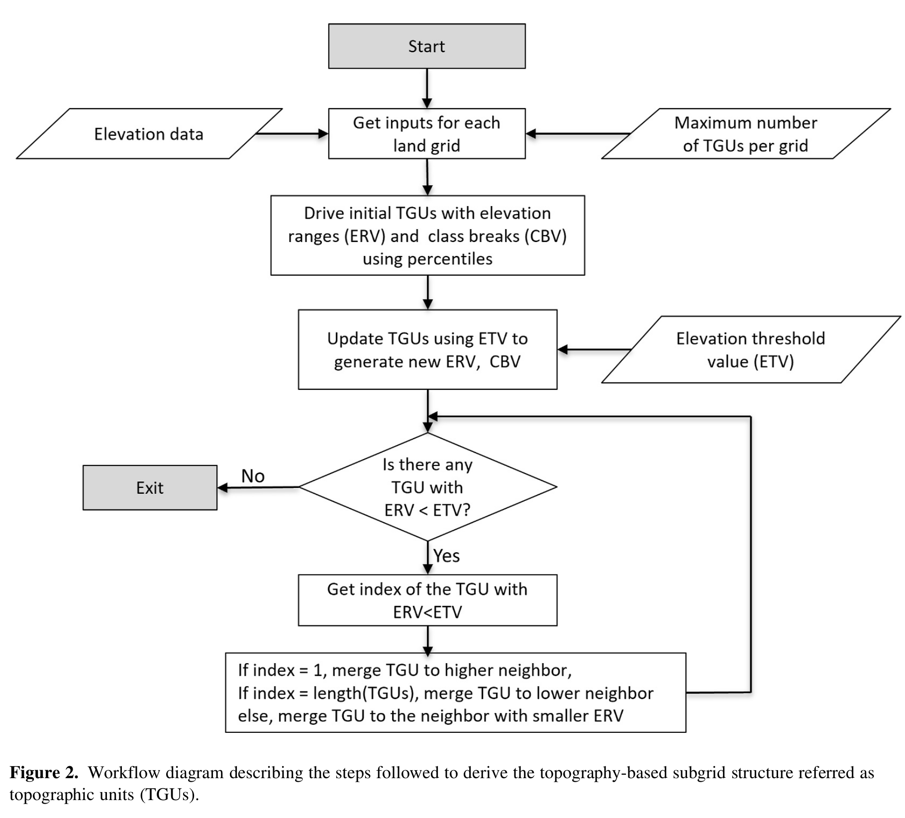
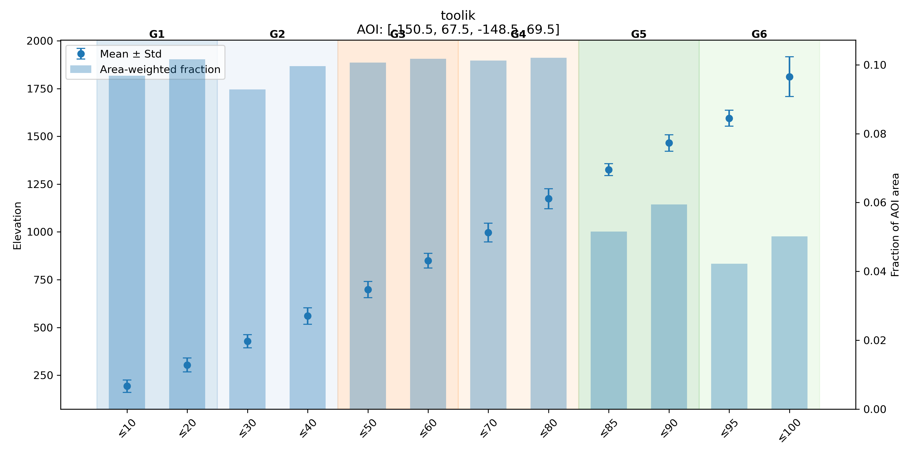

Hillslope hydrology and BGC impacts breakout group
==================================================

Objectives of the workshop breakout
-----------------------------------
Objectives of this workshop breakout is learn how to set up and run ELM
simulations to explore a set of four ELM confgurations:

+----------------+------------------+---------------------+----------------------------+
| Simulation #   | Spatial Extent   | Spatial Resolutions | Features                   |
+================+==================+=====================+============================+
| 1              | Panarctic        | 0.5 deg             | Topounits = **ON**         |
|                |                  |                     | Downscaling = OFF          |
|                |                  |                     | IM2 Hillslope Hyd = OFF    |
+----------------+------------------+---------------------+----------------------------+
| 2              | Panarctic        | 0.5 deg             | Topounits = **ON**         |
|                |                  |                     | Downscaling = OFF          |
|                |                  |                     | IM2 Hillslope Hyd = **ON** |
+----------------+------------------+---------------------+----------------------------+
| 3              | Panarctic        | 0.5 deg             | Topounits = **ON**         |
|                |                  |                     | Downscaling = **ON**       |
|                |                  |                     | IM2 Hillslope Hyd = OFF    |
+----------------+------------------+---------------------+----------------------------+
| 4              | Panarctic        | 0.5 deg             | Topounits = **ON**         |
|                |                  |                     | Downscaling = **ON**       |
|                |                  |                     | IM2 Hillslope Hyd = **ON** |
+----------------+------------------+---------------------+----------------------------+

Background on ELM features we will explore
------------------------------------------

Topounits
~~~~~~~~~
Topography-based subgrid scheme (or **Topounits**) and methods for
downscaling of atmospheric forcings were introduced in ELM by Tesfa et.
al. 2024 to better resolve terrestrial processes in regions of
heterogeneous terrain. 

::

    Tesfa, T. K., Leung, L. R., Thornton, P. E., Brunke, M. A., & Duan, Z. (2024). Impacts of Topography‐Based Subgrid Scheme and Downscaling of Atmospheric Forcing on Modeling Land Surface Processes in the Conterminous US. Journal of Advances in Modeling Earth Systems, 16(8). https://doi.org/10.1029/2023ms004064

Tesfa et. al. 2024 derived **topounits** from high resolution elevation data (90 m) for the half
degree grids. **Topounits**‐based surface properties (including PFTs,
soil texture etc.) input parameters were
generated by mapping grid‐level values onto the TGUs of each grid.

The algorithm extracts elevation values based on the boundary of the modeling unit (grid) and discretizes the
modeling unit into 12 initial subgrid units using the 12 percentile elevation values calculated to represent the
elevation values at each consecutive percentile (10th, 20th, 30th, 40th, 50th, 60th, 70th, 80th, 85th, 90th, 95th and
100th). Then, the 12 values of elevation range are determined using the minimum elevation value within each grid
and the corresponding percentile elevation values as class breaks.
Furthermore, the 100‐m elevation threshold value is used to
calculate new values of elevation class break using a recursive
algorithm developed by Tesfa et. al. 2024. The recursive
algorithm merges any elevation class with elevation range less than the
threshold value to its neighboring class recursively until all the classes with elevation range smaller than the threshold value are removed.
This allows the topography‐based subgrid scheme to capture the impacts of topographic heterogeneity while
minimizing computational demand of the model by varying the number of
**topounits** per grid depending on the topographic heterogeneity within each modeling unit.

.. list-table::
   :widths: 50 50
   :class: borderless

   * - .. figure:: ../_static/hillslope_bgc/toolik_dem_latlon.png
         :width: 100%

         Digital Elevation Model (DEM) near Toolik Field Station

     - .. figure:: ../_static/hillslope_bgc/toolik_dem_grouped.png
         :width: 100%

         Topounits (recursive merging) for Toolik Field Station identify 6 topounits

Plot below show the 12 percentile based elevation bins and the recursive
merge strategy to create the topounits.

Atmospheric Downscaling Scheme
~~~~~~~~~~~~~~~~~~~~~~~~~~~~~~

IM2 Hillslope Hydrology
~~~~~~~~~~~~~~~~~~~~~~~

ELM Domain/Surface Datasets
-----------------------------------

ELM Domain Files
~~~~~~~~~~~~~~~~

ELM Surface Datasets
~~~~~~~~~~~~~~~~~~~~

ELM Forcing Files
~~~~~~~~~~~~~~~~~

Running ELM
-----------
