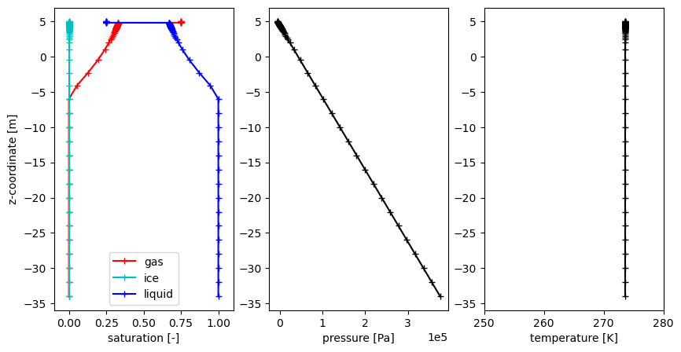
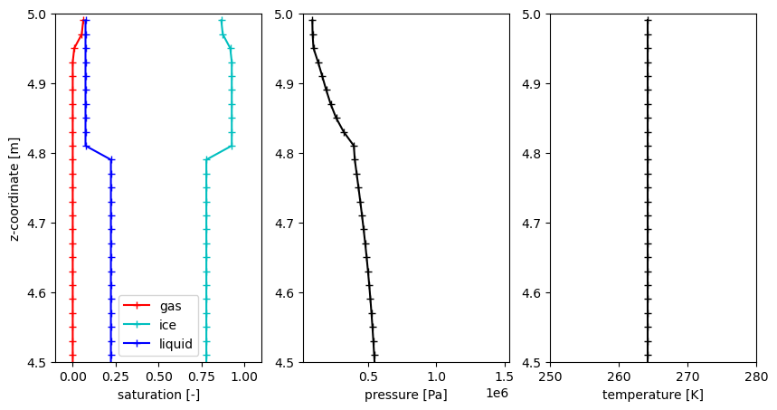
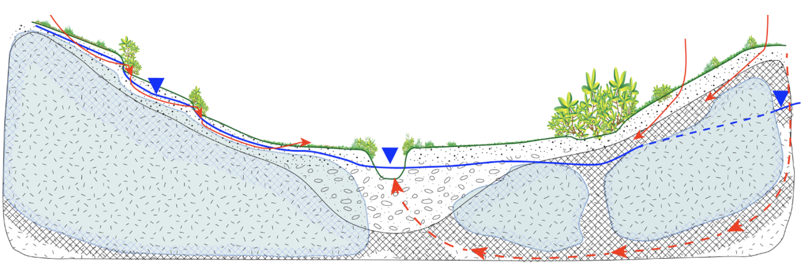

Permafrost hydrology breakout group
====================================

In this breakout group, we will be investigating different options for representing permafrost hydrology in ELM and ATS.
The main goals of this breakout group will be to demonstrate the sensitivity of model simulations to choices in model physics
and surface boundary conditions, using a field site of Utqiagvik, Alaska as the test case.

If you don't still have a visualization container running, please start one now:

.. code-block:: bash

       docker run -it --pull always --rm \
        -p 8888:8888 \
        -v $(pwd):/home/jovyan \
        -v inputdata:/mnt/inputdata \
        -v output:/mnt/output \
        yuanfornl/ngee-arctic-modex26:vis-main-latest

.. note:: 

    We updated a few things recently for this breakout group to add the ``more_vertlayers`` option (since this morning),
    so we'll have to update our repositories:

    .. code-block:: bash

        cd field-to-model
        git pull origin main
        git submodule update --init --recursive
        docker run -it --pull always --rm \
            -p 8888:8888 \
            -v $(pwd):/home/jovyan \
            -v inputdata:/mnt/inputdata \
            -v output:/mnt/output \
            yuanfornl/ngee-arctic-modex26:models-main-latest \
            /home/jovyan/tools/scripts/get_inputdata.sh
        

Background on ELM subsurface hydrology and soil column layer
------------------------------------------------------------

ELM's vertical discretization
^^^^^^^^^^^^^^^^^^^^^^^^^^^^^^

ELM represents the subsurface using a vertically discretized soil column designed to resolve strong near-surface gradients while still extending deep enough to capture deep soil temperature responses. The standard configuration uses 15 soil layers with exponentially increasing thickness with depth, placing many thin layers near the surface where temperature, moisture, and freeze–thaw gradients are sharp, and fewer, thicker layers at depth where changes are slower. Importantly, ELM only computes hydrology on the top 10 layers, which extends to ~3.8 meters depth. The remaining five layers below this depth are only used for thermal calculations and do not participate in water storage or flow.

Relative to many other land surface models, the ELM soil column extends deeper into the subsurface than many other models, however, it has fairly coarse resolution between 0.5-3.8 meters and so the ability to resolve important permafrost processes in this region may be limited. (See figure below):

.. figure:: ../_static/permafrost_breakout/model_vertical_structure.png
   :alt: Land surface model vertical discretization comparison
   :width: 80%

   Figure illustrating differences in vertical discretization across 8 land surface models. ELM is third from left. Figure from Matthes et al. (2025).

Freezing physics in ELM: heat, phase change, and “supercooled” water
^^^^^^^^^^^^^^^^^^^^^^^^^^^^^^^^^^^^^^^^^^^^^^^^^^^^^^^^^^^^^^^^^^^^

ELM treats soil freezing as a fully coupled thermal–hydrologic process rather than as a binary of frozen or thawed. Soil temperatures are computed by solving the heat conduction equation through a vertically layered soil  column, accounting for heat capacity and thermal conductivity that depend on soil moisture, ice, and organic matter (Oleson et al. 2013). Once temperatures are updated, the model checks whether conditions allow phase change—freezing or melting of soil water—and adjusts liquid water, ice content, and temperature in a way that conserves energy (latent heat effects are explicitly included).

A key feature is the treatment of supercooled soil water. Even below 0°C, not all pore water freezes immediately. Instead, ELM uses a freezing-point-depression relationship tied to soil matric potential (based on Clapp–Hornberger parameters) to allow liquid water and ice to coexist over a range of subfreezing temperatures. This is physically important: fine-textured soils can retain unfrozen water well below 0°C, which allows limited flow and transport to continue in cold conditions.

Ice impedance: how frozen soil restricts water movement
^^^^^^^^^^^^^^^^^^^^^^^^^^^^^^^^^^^^^^^^^^^^^^^^^^^^^^^^

When ice forms in the pore space, it does not simply remove water—it blocks flow pathways. ELM represents this using an ice impedance factor, which reduces hydraulic conductivity as a function of the fraction of pore space filled with ice. This reduction follows a strong power-law relationship, meaning that even moderate ice contents can dramatically lower permeability. In practice, partially frozen layers can behave almost like impermeable barriers.

.. math::

    k = 10^{-\Omega F_{ice}} \, k_{sat}
       \left( \frac{\theta_{liq}}{\phi} \right)^{2B + 3}

Perched drainage and runoff above frozen layers
^^^^^^^^^^^^^^^^^^^^^^^^^^^^^^^^^^^^^^^^^^^^^^^

Because frozen soil layers strongly restrict downward flow, ELM allows for the formation of perched saturated zones. These occur when unfrozen, wet soil overlies an ice-rich layer that impedes drainage. Water accumulates above the frozen layer until the soil becomes nearly saturated. Once this perched zone forms, ELM parameterizes lateral drainage (runoff) from it, representing flow downslope along the frozen barrier.

The strength of this perched drainage depends on several factors: the thickness of the saturated zone, the (ice-reduced) hydraulic conductivity, and the grid-cell mean slope. The model explicitly identifies the frost table (the top of the frozen barrier) and the depth of the perched water table, then removes water laterally from the intervening layers.

Additional notes
^^^^^^^^^^^^^^^^^
Key differences to keep in mind between the two models used in this breakout session:
- ELM at ATS use different soil water retention models. ELM uses Clapp and Hornberger, while ATS uses van Genuchten.
- ATS has cryosuction physics implemented, while ELM does not.

Impact of initialization conditions and vertical layer structure on permafrost hydrology
-----------------------------------------------------------------------------------------

The ice impedance parameterization can cause results to be very sensitive to the choices of initial conditions. This sensitivity arises from the lack of permeability in the top frozen layer. Because soil columns in the high-Arctic freeze rapidly after initialization, this can rapidly cause a lens to form that prohibits any additional drainage through that layer. If the initial conditions before this layer freezes are too dry, this can cause a subsurface that is unrealistically dry below the first frozen layer. By default, ELM initializes its soil column at 15% of liquid saturation and at 274K, which for many Arctic simulations leads to this condition where the subsurface is quite dry below the active layer. An alternative initialization scheme that is implemented in ELM is to initialize the soil column at 70% liquid saturation and at a more appropriate approximated temeperature than using 274K globally - we have chosen to use 270 + 20 * cos(latitude) for this initialization option.

Polygonal tundra landscapes
----------------------------

Networks of subsurface ice wedges can create polygonal tundra landscapes. The ice wedges alter Arctic hydrology both by promoting microtopographic variations at the surface that affects surface water storage capacity and by acting as subsurface barriers to lateral flow. 

.. figure:: ../_static/permafrost_breakout/AboltYoungPolygons.png
   :alt: Example of polygonal tundra landscape
   :width: 80%

   DEM (a) and polygon classification (b) of a landscape south of Prudhoe Bay, Alaska (Abolt and Young, 2020). In (b), high-centered polygons are shown in red, flat-centered polygons are closer to white, and low-centered polygons are shown in blue.

In Phase 3 of NGEE Arctic, a new parameterization to represent these polygonal landscapes was introduced to try to capture these effects in ELM (Demir et al. in preparation). This parameterization was developed using intermediate-scale ATS simulations of polygonal tundra to inform new functional relationships between microtopography and surface and subsurface hydrology in ELM. 

We've provided surface files that we can investigate the impacts of this parameterization against the simulations we created above.

ATS Permafrost Hydrology
-------------------------------------

.. note::

    This is an adaptation of the arctic_demos.ipynb notebook we've provided in the ``model_examples/ATS/`` folder of the field-to-model repository. If you want to run that notebook interactively you may wish to start there!

Please also open a terminal in the **modeling** container (note: if you have make installed on your system,
you can just run ``make model-shell`` in a terminal window to get this shell).

In the **modeling** container terminal, you'll need to do some setup.  Run the script:

.. code-block:: 

   . /home/modex_user/model_examples/ATS/setup_ats.sh

Note that this will move you into the directory `/mnt/output/ATS`, which is where all of our demos will be run from.  It also sets an environment variable pointing to this location:

.. code-block:: 

   echo $ATS_DEMOS

Conceptual Model
^^^^^^^^^^^^^^^^

We will work largely on a vertical column model for this workshop, just to make it simpler to compare with ELM.

In this column, we will use a "telescoping" grid that starts with small dz = 2cm at the surface and grows to dz = 2 meters at "depth," which is chosen to be below continuous permafrost and deep enough to be below the thermal wave (e.g. at constant temperature over decadal-to-century timescales). 

Demo 1: Establish a water table
^^^^^^^^^^^^^^^^^^^^^^^^^^^^^^^

First we simply establish a "hydrostatic" condition -- a column of water that is not moving.

.. math::

    p = p_{atm} - \rho g (z - z_{water})

This is the simplest thing to do in an ATS run, but will let us ensure we can run ATS and visualize the output.

In the **modeling** container's bash shell:

.. code-block:: 

    cd $ATS_DEMOS/01_water_column
    ats ../input/01_water_column.xml &> out.log

What do you expect to see?

    * linear solution of pressure with depth (hydrostatic)
    * a water table (saturation = 1) below, a vadose zone (saturation < 1) above

Explore the output.

.. code-block:: 

   less out.log

   
Some notes:
    * We start with a solution that is very close to hydrostatic already (it would be except for the compressibility of water), so the error is initially effectively 0.
    * The timestep grows quickly from the initial step size to very large timesteps.
    * ATS is tracking the conservation of mass and energy -- eventually the step becomes large enough so that the error is greater than tolerance, and then the solver starts to do work.

.. code-block:: python

   # full column
   fig, axs = plt.subplots(1,3, figsize=figsize)
   plotTime('00_water_column', axs, '-+', -1)
   decorate(axs)
   
   # and a zoomed version that shows the very shallow subsurface
   fig, axs = plt.subplots(1,3, figsize=figsize)
   plotTime('00_water_column', axs, '-+', -1)
   decorate(axs)
   axs[0].set_ylim([4.5,5])
   axs[1].set_ylim([4.5,5])
   axs[2].set_ylim([4.5,5])
   plt.show()

.. figure:: ../_static/permafrost_breakout/ats-1b.png
   :alt: ATS demo1b
   :width: 80%

Why is the saturation discontinuous?

ATS makes extensive use of heterogeneous soil properties.  Arctic models typically require at least an organic-rich peat and a mineral soil.  In this demo, we will use a domain with 20 cm of peat on top of the mineral soil.

These have very different porosity, permeability, and water retention properties: let's compare peat mineral soil.

.. code-block:: python

   fig, ax = plt.subplots(1,1, figsize=figsize)
   
   # peat
   vg_peat = plot_wrm.VanGenuchten(alpha=0.0005, n=1.39, sr=0.05)
   plot_wrm.plot(vg_peat, ax, 'forestgreen', label='peat', y_units='m') 
   
   # mineral soil
   vg_min = plot_wrm.VanGenuchten(alpha=0.00002, n=1.58, sr=0.2)
   plot_wrm.plot(vg_min, ax, 'brown', label='mineral soil', y_units='m') 
   ax.legend()
   
   plt.show()

.. figure:: ../_static/permafrost_breakout/ats-1c.png
   :alt: ATS demo1c
   :width: 80%

Demo 2: Freeze from below
^^^^^^^^^^^^^^^^^^^^^^^^^

Now we want to model permafrost -- how do we initialize a frozen water table?

Guess 1: set the temperature at depth < 0 (in this case T = -9°C) and freeze the column of water.

In the **modeling** container's bash shell:

.. code-block:: 

    cd $ATS_DEMOS/02_freezeup_from_below
    ats ../input/02_freezeup_from_below.xml &> out.log
   
What do you expect to see?

    * A "frozen" water table, with ice saturation = 1?  With gas saturation = 0?

.. code-block:: python

   # full column
   fig, axs = plt.subplots(1,3, figsize=figsize)
   plotTime('02_freezeup_from_below', axs, '-+', -1)
   decorate(axs)
   
   # and a zoomed version that shows the very shallow subsurface
   fig, axs = plt.subplots(1,3, figsize=figsize)
   plotTime('02_freezeup_from_below', axs, '-+', -1)
   decorate(axs)
   axs[0].set_ylim([4.5,5])
   axs[1].set_ylim([4.5,5])
   axs[2].set_ylim([4.5,5])
   plt.show()

.. figure:: ../_static/permafrost_breakout/ats-2a.png
   :alt: ATS demo2a
   :width: 80%

Why is the ice table so much higher than the water table?

Ice is less dense than water.  While the total water (moles of H\ :sub:`2`\O) is conserved, the frozen ice table takes up more volume than the corresponding water table.

Demo 3: Freeze from above
^^^^^^^^^^^^^^^^^^^^^^^^^

Why didn't we freeze from above?  Good question -- let's try it!

In the **modeling** container's bash shell:

.. code-block:: 

    cd $ATS_DEMOS/03_freezeup_from_above
    ats ../input/03_freezeup_from_above.xml &> out.log

What do you expect to see?

    * same as above?

.. code-block:: python

   # full column
   fig, axs = plt.subplots(1,3, figsize=figsize)
   plotTime('03_freezeup_from_above', axs, '-+', -1)
   decorate(axs)
   
   # and a zoomed version that shows the very shallow subsurface
   fig, axs = plt.subplots(1,3, figsize=figsize)
   plotTime('03_freezeup_from_above', axs, '-+', -1)
   decorate(axs)
   axs[0].set_ylim([4.5,5])
   axs[1].set_ylim([4.5,5])
   axs[2].set_ylim([4.5,5])
   plt.show()

.. figure:: ../_static/permafrost_breakout/ats-3a.png
   :alt: ATS demo3a
   :width: 80%

.. figure:: ../_static/permafrost_breakout/ats-3b.png
   :alt: ATS demo3b
   :width: 80%

Why is unsaturated zone so much deeper?

*Cryosuction* In a freezing, unsaturated soil, the pressure drops, pulling nearby unfrozen water into the freezing front.

Comparison of lab experiments (dots) (Watanabe & Mizoguchi 2002 at left, Jame & Norum 1980 at right) to simulations (Painter 2011) shows that cryosuction can be accurately modeled in coupled flow & energy models, given the right constitutive models.

!`image.png <attachment:c3b6a50a-5a9f-40ed-b68a-0cf02ce417d6.png>`_

Demo 4: Spin up the column
^^^^^^^^^^^^^^^^^^^^^^^^^^

We now have a frozen ice table -- let's apply meteorological data and do a transient run.

The second step of spinup is to apply a "typical" or "averaged" meteorological forcing from a given climatology to get reasonable temperature profiles

.. code-block:: python

   # plot the met data

In the **modeling** container's bash shell:

.. code-block:: 

    cd $ATS_DEMOS/04_permafrost_column
    ats ../input/04_permafrost_column.xml &> out.log

What do you expect to see?

    * A thermal wave progating from the surface to the subsurface.
    * An active layer thawing and freezing.

.. code-block:: python

   # full column
   fig, axs = plt.subplots(2,2, figsize=(figsize[0], figsize[1]*1.2))
   html = plotAnimation('04_permafrost_column', fig, axs, '-', fps=10)
   plt.close(axs[0,0].figure)
   html

What do you expect to see?

    * A thermal wave progating from the surface to the subsurface.
    * An active layer thawing and freezing.

Demo 5: Lateral, supra-permafrost flow
^^^^^^^^^^^^^^^^^^^^^^^^^^^^^^^^^^^^^^

Columns are nice (and simple) but do not capture supra-permafrost lateral flow, which is the crucial pathway for water movement in sloped landscapes in Arctic watersheds.  When through taliks form, we expect fundamental changes in the flow pathways.

(courtesy Cathy Wilson)

As the Arctic warms, we expect flow pathways to get deeper, accessing the mineral soil (low porosity, permeability) more than the organic layer (high porosity, permeability).

.. figure:: ../_static/permafrost_breakout/permo-lateral.png
   :alt: ATS demo3a
   :width: 80%
   
(O'Connor et al 2019)

In the **modeling** container's bash shell:

.. code-block:: 

    cd $ATS_DEMOS/05_permafrost_transect
    ats ../input/05_permafrost_transect.xml &> out.log

What do you expect to see?

    * ???

Full ELM runs
---------------

The full simulations, including the spinup stages can be run as follows:

.. warning::

    The following commands assume that Docker has been set up to have access to multiple cores on your machine. You can set this by going into the preferences and making >1 CPU available. The commands below assume you have 4 CPUs assigned - the key here is that the argument value to ``--cpuset-cpus`` is not greater than the number of CPUs assigned - 1.

    .. figure:: ../_static/permafrost_breakout/docker-resources.png
        :alt: ATS demo3a
        :width: 80%

Initial condition comparison:

Default:

.. code:: 

    docker run -it --pull always --rm --cpuset-cpus 0 \
        -v inputdata:/mnt/inputdata \
        -v output:/mnt/output \
        yuanfornl/ngee-arctic-modex26:models-main-latest \
        /home/modex_user/model_examples/ELM/run_ngeearctic_site.sh --site_name=beo

Wet/icy spinup:

.. code::
    
    docker run -it --pull always --rm --cpuset-cpus 1 \
        -v inputdata:/mnt/inputdata \
        -v output:/mnt/output \
        yuanfornl/ngee-arctic-modex26:models-main-latest \
        /home/modex_user/model_examples/ELM/run_ngeearctic_site.sh --site_name=beo \
        --use_arctic_init --case_prefix=ArcticInit

More layers + wet spinup:

.. code::

    docker run -it --pull always --rm --cpuset-cpus 2 \
        -v inputdata:/mnt/inputdata \
        -v output:/mnt/output \
        yuanfornl/ngee-arctic-modex26:models-main-latest \
        /home/modex_user/model_examples/ELM/run_ngeearctic_site.sh --site_name=beo \ 
        --use_arctic_init --more_vertlayers --case_prefix=vertlayers

Polygonal tundra:

.. code::

    docker run -it --pull always --rm --cpuset-cpus 3 \
        -v inputdata:/mnt/inputdata \
        -v output:/mnt/output \
        yuanfornl/ngee-arctic-modex26:models-main-latest \
        /home/modex_user/model_examples/ELM/run_ngeearctic_site.sh --site_name=beo \
        --use_arctic_init --case_prefix=PolygonalTundra --use_polygonal_tundra --mixed_polygons \
        --arctic_topounit_output

Polygonal tundra warming experiment (when the first simulation is done!)

.. code::

    docker run -it --pull always --rm --cpuset-cpus 0 \
        -v inputdata:/mnt/inputdata \
        -v output:/mnt/output \
        yuanfornl/ngee-arctic-modex26:models-main-latest \
        /home/modex_user/model_examples/ELM/run_ngeearctic_site.sh --site_name=beo \
        --use_arctic_init --case_prefix=PolygonalTundraWarming --use_polygonal_tundra --mixed_polygons \
        --add_temperature 5.0 --startdate_add_temperature=20100601 --transient_years 200 \
        --arctic_topounit_output

Note: Generative AI was used to help draft and revise portions of this text. The authors reviewed and edited the content as needed and take full responsibility for the accuracy and appropriateness of the final document.

References 
-------------

Abolt, Charles J., and Michael H. Young. “High-Resolution Mapping of Spatial Heterogeneity in Ice Wedge Polygon Geomorphology near Prudhoe Bay, Alaska.” Scientific Data 7, no. 1 (2020): 87. https://doi.org/10.1038/s41597-020-0423-9.

Jame, Yih‐Wu, and Donald I. Norum. "Heat and mass transfer in a freezing unsaturated porous medium." Water resources research 16.4 (1980): 811-819.

O'Connor, Michael T., et al. "Active layer groundwater flow: The interrelated effects of stratigraphy, thaw, and topography." Water Resources Research 55.8 (2019): 6555-6576.

Painter, Scott L. "Three-phase numerical model of water migration in partially frozen geological media: model formulation, validation, and applications." Computational Geosciences 15.1 (2011): 69-85.

Watanabe, Kunio, and Masaru Mizoguchi. "Amount of unfrozen water in frozen porous media saturated with solution." Cold Regions Science and Technology 34.2 (2002): 103-110.