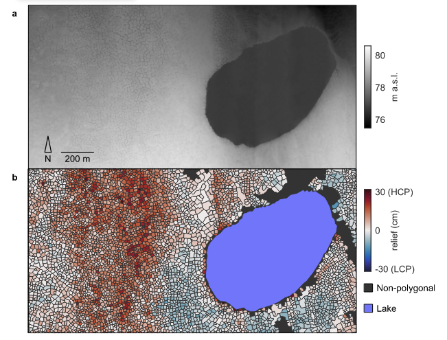

Permafrost hydrology breakout group
====================================

In this breakout group, we will be investigating different options for representing permafrost hydrology in ELM and ATS.
The main goals of this breakout group will be to demonstrate the sensitivity of model simulations to choices in model physics
and surface boundary conditions, using a field site of Utqiagvik, Alaska as the test case.

If you don't still have a visualization container running, please start one now:

.. code-block:: bash

       docker run -it --pull always --rm \
        -p 8888:8888 \
        -v $(pwd):/home/jovyan \
        -v inputdata:/mnt/inputdata \
        -v output:/mnt/output \
        yuanfornl/ngee-arctic-modex26:vis-main-latest

Background on ELM subsurface hydrology and soil column layer
------------------------------------------------------------

ELM's vertical discretization
^^^^^^^^^^^^^^^^^^^^^^^^^^^^^^

ELM represents the subsurface using a vertically discretized soil column designed to resolve strong near-surface gradients while still extending deep enough to capture deep soil temperature responses. The standard configuration uses 15 soil layers with exponentially increasing thickness with depth, placing many thin layers near the surface where temperature, moisture, and freeze–thaw gradients are sharp, and fewer, thicker layers at depth where changes are slower. Importantly, ELM only computes hydrology on the top 10 layers, which extends to ~3.8 meters depth. The remaining five layers below this depth are only used for thermal calculations and do not participate in water storage or flow.

Relative to many other land surface models, the ELM soil column extends deeper into the subsurface than many other models, however, it has fairly coarse resolution between 0.5-3.8 meters and so the ability to resolve important permafrost processes in this region may be limited. (See figure below):

.. figure:: ../_static/permafrost_breakout/model_vertical_structure.png
   :alt: Land surface model vertical discretization comparison
   :width: 80%

   Figure illustrating differences in vertical discretization across 8 land surface models. ELM is third from left. Figure from Matthes et al. (2025).

Freezing physics in ELM: heat, phase change, and “supercooled” water
^^^^^^^^^^^^^^^^^^^^^^^^^^^^^^^^^^^^^^^^^^^^^^^^^^^^^^^^^^^^^^^^^^^^

ELM treats soil freezing as a fully coupled thermal–hydrologic process rather than as a binary of frozen or thawed. Soil temperatures are computed by solving the heat conduction equation through a vertically layered soil  column, accounting for heat capacity and thermal conductivity that depend on soil moisture, ice, and organic matter (Oleson et al. 2013). Once temperatures are updated, the model checks whether conditions allow phase change—freezing or melting of soil water—and adjusts liquid water, ice content, and temperature in a way that conserves energy (latent heat effects are explicitly included).

A key feature is the treatment of supercooled soil water. Even below 0°C, not all pore water freezes immediately. Instead, ELM uses a freezing-point-depression relationship tied to soil matric potential (based on Clapp–Hornberger parameters) to allow liquid water and ice to coexist over a range of subfreezing temperatures. This is physically important: fine-textured soils can retain unfrozen water well below 0°C, which allows limited flow and transport to continue in cold conditions.

Ice impedance: how frozen soil restricts water movement
^^^^^^^^^^^^^^^^^^^^^^^^^^^^^^^^^^^^^^^^^^^^^^^^^^^^^^^^

When ice forms in the pore space, it does not simply remove water—it blocks flow pathways. ELM represents this using an ice impedance factor, which reduces hydraulic conductivity as a function of the fraction of pore space filled with ice. This reduction follows a strong power-law relationship, meaning that even moderate ice contents can dramatically lower permeability. In practice, partially frozen layers can behave almost like impermeable barriers.

.. note::TODO

    add ice impedance equation from Oleson et al. 2013 here

Perched drainage and runoff above frozen layers
^^^^^^^^^^^^^^^^^^^^^^^^^^^^^^^^^^^^^^^^^^^^^^^

Because frozen soil layers strongly restrict downward flow, ELM allows for the formation of perched saturated zones. These occur when unfrozen, wet soil overlies an ice-rich layer that impedes drainage. Water accumulates above the frozen layer until the soil becomes nearly saturated. Once this perched zone forms, ELM parameterizes lateral drainage (runoff) from it, representing flow downslope along the frozen barrier.

The strength of this perched drainage depends on several factors: the thickness of the saturated zone, the (ice-reduced) hydraulic conductivity, and the grid-cell mean slope. The model explicitly identifies the frost table (the top of the frozen barrier) and the depth of the perched water table, then removes water laterally from the intervening layers.

Additional notes
^^^^^^^^^^^^^^^^^
Key differences to keep in mind between the two models used in this breakout session:
- ELM at ATS use different soil water retention models. ELM uses Clapp and Hornberger, while ATS uses van Genuchten.
- ATS has cryosuction physics implemented, while ELM does not.

Impact of initialization conditions and vertical layer structure on permafrost hydrology
-----------------------------------------------------------------------------------------

The ice impedance parameterization can cause results to be very sensitive to the choices of initial conditions. This sensitivity arises from the lack of permeability in the top frozen layer. Because soil columns in the high-Arctic freeze rapidly after initialization, this can rapidly cause a lens to form that prohibits any additional drainage through that layer. If the initial conditions before this layer freezes are too dry, this can cause a subsurface that is unrealistically dry below the first frozen layer. By default, ELM initializes its soil column at 15% of liquid saturation and at 274K, which for many Arctic simulations leads to this condition where the subsurface is quite dry below the active layer. An alternative initialization scheme that is implemented in ELM is to initialize the soil column at 100% liquid saturation and at a more appropriate approximated temeperature than using 274K globally - we have chosen to use 250 + 40 * cos(latitude) for this initialization option.

To help speed up the simulations in these breakout groups, we have provided restart files from the end of the two spinup stages in OLMT.

Polygonal tundra landscapes
----------------------------

Networks of subsurface ice wedges can create polygonal tundra landscapes. The ice wedges alter Arctic hydrology both by promoting microtopographic variations at the surface that affects surface water storage capacity and by acting as subsurface barriers to lateral flow. 

   DEM (a) and polygon classification (b) of a landscape south of Prudhoe Bay, Alaska (Abolt and Young, 2020). In (b), high-centered polygons are shown in red, flat-centered polygons are closer to white, and low-centered polygons are shown in blue.

In Phase 3 of NGEE Arctic, a new parameterization to represent these polygonal landscapes was introduced to try to capture these effects in ELM (Demir et al. in preparation). This parameterization was developed using intermediate-scale ATS simulations of polygonal tundra to inform new functional relationships between microtopography and surface and subsurface hydrology in ELM. 

We've provided surface files that we can investigate the impacts of this parameterization against the simulations we created above.

Impacts of cryosuction (ATS)
----------------------------

Note: Generative AI was used to help draft and revise portions of this text. The authors reviewed and edited the content as needed and take full responsibility for the accuracy and appropriateness of the final document.

Full runs
^^^^^^^^^
The full simulations, including the spinup stages can be run as follows:

Initial condition comparison:

Default:

.. code:: 

    docker run -it --pull always --rm \
        -v  $(pwd):/home/modex_user \
        -v inputdata:/mnt/inputdata \
        -v output:/mnt/output \
        yuanfornl/ngee-arctic-modex26:models-main-latest \
        /home/modex_user/model_examples/ELM/run_ngeearctic_site.sh --site_name=beo

Wet/icy spinup:

.. code::
    
    docker run -it --pull always --rm \
        -v  $(pwd):/home/modex_user \
        -v inputdata:/mnt/inputdata \
        -v output:/mnt/output \
        yuanfornl/ngee-arctic-modex26:models-main-latest \
        /home/modex_user/model_examples/ELM/run_ngeearctic_site.sh --site_name=beo \
        --use_arctic_init --case_prefix=ArcticInit

More layers + wet spinup:

Polygonal tundra:

.. code::

    docker run -it --pull always --rm \
        -v  $(pwd):/home/modex_user \
        -v inputdata:/mnt/inputdata \
        -v output:/mnt/output \
        yuanfornl/ngee-arctic-modex26:models-main-latest \
        /home/modex_user/model_examples/ELM/run_ngeearctic_site.sh --site_name=beo \
        --use_arctic_init --case_prefix=PolygonalTundra --use_polygonal_tundra --MISSING_SURFACE_FILE ARG

Polygonal tundra warming experiment:

.. code::

    docker run -it --pull always --rm \
        -v  $(pwd):/home/modex_user \
        -v inputdata:/mnt/inputdata \
        -v output:/mnt/output \
        yuanfornl/ngee-arctic-modex26:models-main-latest \
        /home/modex_user/model_examples/ELM/run_ngeearctic_site.sh --site_name=beo \
        --use_arctic_init --case_prefix=PolygonalTundra --use_polygonal_tundra --MISSING_SURFACE_FILE ARG \
        --add_temperature 5.0