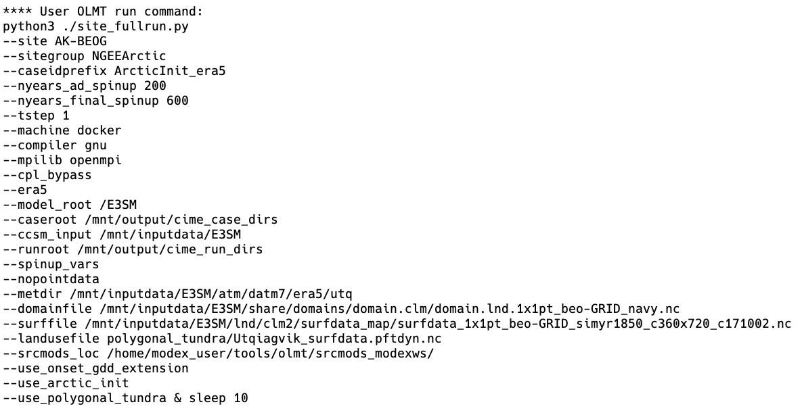
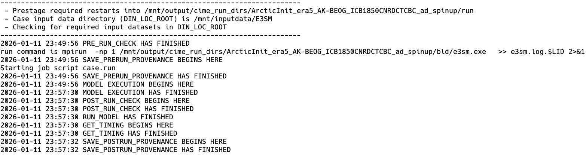
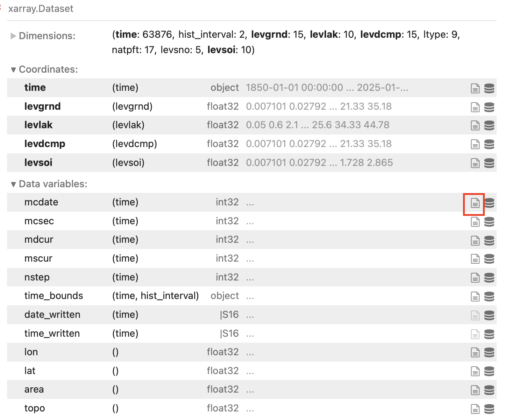
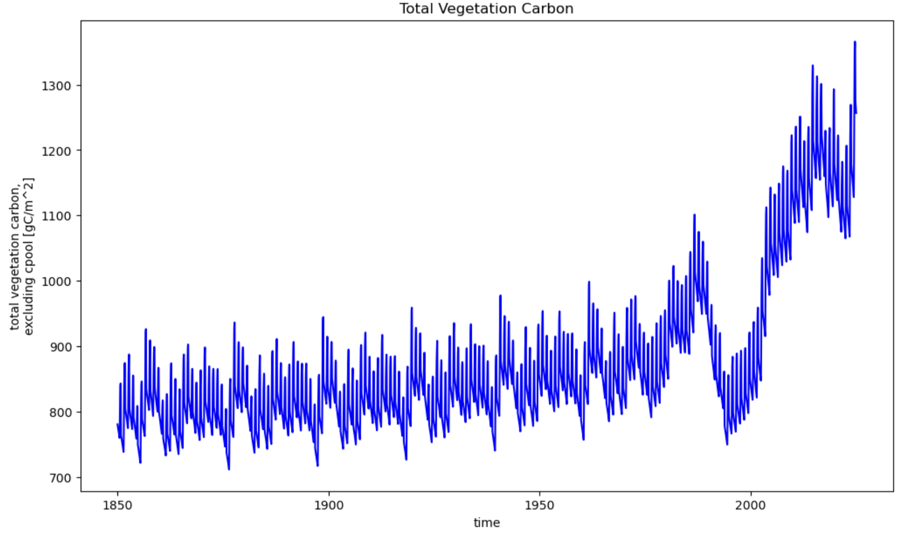

Introduction to ELM and workshop scripts
=========================================

The E3SM Land Model (ELM) is the land surface component of the coupled E3SM model. 
ELM simulates a wide set of land surface and ecosystem processes, including surface 
energy balance, photosynthesis, carbon allocation, soil and surface hydrology, 
nitrogen and phosphorus dynamics, and snow processes, among others. 
ELM can be run by itself (if provided meteorological forcing data) or in 
different coupling configurations of E3SM. In addition, ELM can be run in point 
(e.g., single grid cell), regional, or global configurations.

For this workshop, we have simplified the process of running ELM for several Arctic 
sites using a shell script. Several of the new parameterizations added in phase 3 of 
the NGEE Arctic project are accessible through this script, as are several ways of 
testing the sensitivity of model results to changes in forcing conditions. 

If you just completed 'Step 2. Getting Started', first open a new Terminal window (Terminal, Cmd + N) and navigate to your field-to-model folder with the following code. For any code blocks starting with 'docker run', you should be in your field-to-model directory. 

.. code:: 

    cd field-to-model

You can see the options that are available for the script by running:

.. code:: 

    docker run -it --pull always --rm \
        -v  $(pwd):/home/modex_user \
        -v inputdata:/mnt/inputdata \
        -v output:/mnt/output \
        yuanfornl/ngee-arctic-modex26:models-main-latest \
        /home/modex_user/model_examples/ELM/run_ngeearctic_site.sh -h

In the first example, we will run a 'control' case for one of the NGEE Arctic sites where 
none of the new capabilities developed for NGEE Arctic have been turned on. There are 9 sites
you can choose from and substitute into the command below at <site_name> (must delete angle brackets):

.. code::

 docker run -it --pull always --rm \
    -v  $(pwd):/home/modex_user \
    -v inputdata:/mnt/inputdata \
    -v output:/mnt/output \
    yuanfornl/ngee-arctic-modex26:models-main-latest \
    /home/modex_user/model_examples/ELM/run_ngeearctic_site.sh \
    --site_name=<site_name>

This command will run three ELM cases (Rosenbloom and Thornton, 2004): a) a spinup with accelerated
biogeochemical cycling (to more rapidly spinup biogeochemical pools), b) a second stage of spinup with
normal biogeochemical cycling rates, and c) a transient run with time-varying CO2 and meteorological forcing
from 1850 to near present (2024 for ERA5, 2014 for GSWP3). In this default configuration, ERA5 meteorological
forcing from dapper will be used, but GSWP3 is available as an option for comparison.

We can open a second shell window (Terminal, Cmd + N for a new window, or Cmd + T for a new tab) and run a second set of cases while this first case is running. As an example, let's change the initial conditions of the first spinup case. By default, ELM initializes at 274K and at fairly dry soil conditions. A new initialization option, ``--use_arctic_init``, sets wetter and colder initial conditions for the first step (soil column at 70% liquid saturation, and at a temperature varying between 290K and 270K based on `cos(lat)`).

.. code::

 docker run -it --pull always --rm \
    -v  $(pwd):/home/modex_user \
    -v inputdata:/mnt/inputdata \
    -v output:/mnt/output \
    yuanfornl/ngee-arctic-modex26:models-main-latest \
    /home/modex_user/model_examples/ELM/run_ngeearctic_site.sh --site_name=<site_name> \
    --use_arctic_init --case_prefix=Arctic_init

After these runs are completed, we can compare the impacts of this initialization choice using the visualization containers.

.. warning::
    Note that if you rerun one of these commands, the existing output and case directories for these simulations are removed!
    Therefore, if you want to perform a second simulation on a site, you should also set the `--case_prefix` option so that
    the case has a different name. In this case, we have set it to "Arctic_init" to distinguish it from our control.

Adding demography and disturbance: ELM-FATES
--------------------------------------------
FATES is the “Functionally Assembled Terrestrial Ecosystem Simulator.” It is an optional external module which can run within ELM to include alternative representations of ecosystem processes, namely vegetation demography and dynamic vegetation and disturbance.  FATES is a cohort- and patch-based model of vegetation competition and co-existence, allowing a representation of the terrestrial biosphere which accounts for the division of the land surface into successional stages, and for competition for light between height structured cohorts of representative trees of various plant functional types.

A very detailed explain of FATES can be found in this `Technical Documentation <https://fates-users-guide.readthedocs.io/projects/tech-doc/en/latest/index.html>`__

The source code for FATES, as well as discussion boards, and tracking changes can be found in this `GitHub repository <https://github.com/NGEET/fates>`__

For this workshop, we will not go into the details of setting up and running FATES. However, we encourage users to visit previous User Guide documentation, and past `FATES Tutorial documents <https://fates-users-guide.readthedocs.io/en/latest/>`__ (the latest tutorial was in Fall 2024). 
  
Here are a few quick instructions and tips for running ELM-FATES:

* FATES will use these same files from ELM: the surface file, domain file, climatology driver data, and ELM parameter file.  The main difference is that FATES has its own parameter file for FATES specific PFT and site level parameters. 
* Before running FATES we need to generate a parameter file that describes the traits of each Plant Functional Type (PFT) in our simulation.
* A main way to "turn on" the FATES model is through a compset. Example compsets for FATES are IELMFATES or I1850ELMFATES
* There is also a containerized version of FATES using Docker, which was created in 2024.

What's going on under the hood?
------------------------------------
The script we have developed simplifies the interface to the Offline Land Model Testbed (OLMT), developed by
Dan Ricciuto (ORNL). OLMT itself simplifies the setup of model cases necessary to spin up an ELM simulation from
a 'cold start' condition. (Figure of hierarchy?). OLMT sets up three cases that run consecutively: an 'accelerated'
decomposition spin up that features accelerated biogeochemical cycling, a second stage of spin up with normal
biogeochemical cycling rates, and finally a transient run that starts in 1850 and continues to near present
(depending on how long the forcing datasets run). OLMT automates the setup of these cases through the E3SM case
control system (CIME - Common Infrastructure for Modeling the Earth).

Understanding OLMT/E3SM terminal output during the run
^^^^^^^^^^^^^^^^^^^^^^^^^^^^^^^^^^^^^^^^^^^^^^^^^^^^^^^
OLMT, and the E3SM cases that it sets up and runs, will both print output to the terminal window while the model is running.
This output can be useful for diagnosing problems with the run, but it can be hard to parse if you are unfamiliar with the model. 
In this section, we provide a brief overview of what each section of the output means. (Note: all of the python scripts here
are not directly called in the workshop, but are called by the shell script we have provided. You can learn more about these scripts
by viewing the OLMT links in the additional information sections).

First, the ``run_ngeearctic_site.sh`` we have provided will print some information about the case being run:

.. figure:: ../_static/plenary/elm/elm-output-1.png
   :alt: First output stage from ELM
   :width: 80%

Second, the script configures a call to the OLMT Python script, ``site_fullrun.py``, which sets up and runs the ELM cases. The script we have provided lists all of the arguments that are provided to set up the cases:

In turn, ``site_fullrun.py`` sets up each case with three different calls to ``runcase.py`` which uses settings appropriate for each case, and sets them to run sequentially:

.. figure:: ../_static/plenary/elm/elm-output-3.png
   :alt: Third output stage from ELM
   :width: 80%

At this stage, OLMT begins to walk through the CIME scripts that are used to set up and run each case. While there are a lot of details between each step here that can be modified by users, the main steps in using the CIME case management system involve four scripts:
1. ``create_newcase`` - this script sets up a new case directory with the appropriate model components, resolution, and compset (set of E3SM components that are active and how they are configured). This script also creates a case directory.
2. ``case.setup`` - this script sets up the case with the appropriate model parameter files, input data links, user namelist options, and for parallel runs, processor layouts.
3. ``case.build`` - this script compiles the model code for the case (note in the case of OLMT, all three cases use the same executable, so this step is only done for the first case).
4. ``case.submit`` - this script runs the model case. 

The ``create_newcase`` and ``case.setup`` steps are shown below:

.. figure:: ../_static/plenary/elm/elm-output-5.png
   :alt: create_newcase and case.setup output
   :width: 80%

(Note: in this case, each is specified to run on 1 processor. All of the other domains - e.g., ATM, ICE, OCN - are not active in ELM only runs, and since these ELM runs are only a single grid cell, only one processor is needed.)

The model compiles (``case.build``) and the case scripts check to make sure all of the namelists (e.g., a list of options set at runtime that is common in Fortran-based models) are set up correctly:

.. figure:: ../_static/plenary/elm/elm-output-6.png
   :alt: Preview namelists
   :width: 80%

Finally, the model runs:

CIME and configurations of E3SM
^^^^^^^^^^^^^^^^^^^^^^^^^^^^^^^^^
Each component of E3SM (e.g., atmosphere, land, sea ice, ocean, land ice) can be configured in different ways depending on the scientific questions being asked. These configurations are called 'compsets' (component-sets) and define which components are active in a simulation, and how they are configured. CIME provides the "glue" to help orchestrate compilation and running of coupled (or single model component) simulations. Land-only compsets in E3SM start with 'I', and then include components that describe: what time period is being simulated, whether the coupler bypass is being used, what biogeochemistry model is being used (if any, there is also a satellite phenology mode), different models for below-ground decomposition, and whether disturbance and demography (FATES) are enabled.

Visualizing ELM output in Jupyter Lab
--------------------------------------

ELM output, as well as the forcing input datasets, are in NetCDF format. We have provided a Jupyter Lab Docker container that includes packages such as xarray to help examine and visualize the output in these files.

A reminder how to launch the Jupyter lab container if you don't currently have one open - from the ``field-to-model`` directory:

.. code::

    docker run -it --pull always --rm \
        -p 8888:8888 \
        -v $(pwd):/home/jovyan \
        -v inputdata:/mnt/inputdata \
        -v output:/mnt/output \
        yuanfornl/ngee-arctic-modex26:vis-main-latest

And copy and paste the URL and token provided in the terminal into your web browser to access Jupyter Lab.

How different are the meteorological forcing datasets?
^^^^^^^^^^^^^^^^^^^^^^^^^^^^^^^^^^^^^^^^^^^^^^^^^^^^^^^^
We've provided two different meteorological forcing datasets: GSWP3 and ERA5. One reason we might look at multiple forcing datasets is that meterological data in remote Arctic settings is often uncertain, so we might want to see how sensitive our land surface model results are to uncertainty in these forcings. 

In the ``vis_notebooks`` folder, you'll find a notebook titled 01_compare_met_forcing.ipynb. I've shown an example below - this is forcing temperature from Imnaviat Creek, Alaska near Toolik Field Station. Note that while annual means might be similar, GSWP3 seems to be significantly warmer than ERA5 in the spring, but significantly cooler than ERA5 in the fall. What impacts might this have on our simulations?

.. figure:: ../_static/plenary/elm/gswp3vsera5.png
   :alt: Comparing two met forcing datasets.
   :width: 80%

Try working through this notebook a few more times - you can change the value of either "site" or "variable" to look at how different these forcing datasets are across the available sites.

How different are the surface datasets across these sites?
^^^^^^^^^^^^^^^^^^^^^^^^^^^^^^^^^^^^^^^^^^^^^^^^^^^^^^^^^^^^

Examining case output
^^^^^^^^^^^^^^^^^^^^^^
Now that we have some completed simulations, let's take a look at some of the data! In the ``vis_notebooks`` folder, you'll find a notebook titled 02_plot_ELM_output.ipynb that shows some examples of plotting timeseries variables, as well as contour plots for 2D variables (e.g,. soil temperature over time). The ``elm_output`` object shows the variables that are available for plotting:

You can learn the long name of the variable, as well as any other metadata assigned to that variable by the model, by clicking on the button in the green square for any particular variable.

Further down you'll find examples of plotting 1D variables over time as timeseries (these are from a simulation at Abisko, Sweden):

And 2D variables as contour plots (e.g., bottom panel is soil temperature):

.. figure:: ../_static/plenary/elm/analyze_output3.png
   :alt: 2d_vars
   :width: 80%

======================
Additional Resources
======================

1. What variables are on an ELM surface file? https://ngee-arctic.github.io/dapper/surface-variables.html#all-surface-variables
 
